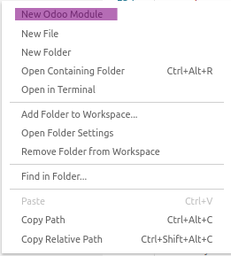

# Visual Code Odoo Scaffold

[](https://marketplace.visualstudio.com/items?itemName=mstuttgart.odoo-scaffold)
[](https://marketplace.visualstudio.com/items?itemName=mstuttgart.odoo-scaffold)
[](https://marketplace.visualstudio.com/items?itemName=mstuttgart.odoo-scaffold)

This Visual Code extension run Odoo [scaffold](https://www.odoo.com/documentation/11.0/reference/cmdline.html#scaffolding) command 
and generate Odoo modules.

## Features

This extension allow create Odoo modules from explorer windown in easy way.

### From window explores menu

Right click on Explorer Window and click in `New Odoo Module`. Confirme the selected path (press `Enter`) and type the new module name and press `Enter`.




### From command lauch

Press `ctrl+shift+p` to open command panel and type `Python: New Odoo Module`. 

Type the path of where new module will be create:


Type the name of new module:


## Requirements

This module dependes of [odoo-bin](https://github.com/odoo/odoo/blob/11.0/odoo-bin) executable in odoo core and work 
Odoo 10.0+ and need of `Python Path` configured.

## Installation

Launch *Quick Open*
  -  <a href="https://code.visualstudio.com/shortcuts/keyboard-shortcuts-linux.pdf">Linux</a> `Ctrl+P`
  -  <a href="https://code.visualstudio.com/shortcuts/keyboard-shortcuts-macos.pdf">macOS</a> `⌘P`
  -  <a href="https://code.visualstudio.com/shortcuts/keyboard-shortcuts-windows.pdf">Windows</a> `Ctrl+P`

Paste the following command and press `Enter`:

```
ext install mstuttgart.odoo-scaffold
```

## Extension Settings

By default the extension uses the configuration from [Python extension for Visual Studio Code](https://marketplace.visualstudio.com/items?itemName=ms-python.python).
To configure Python for your project see [Getting Started with Python in VS Code](https://code.visualstudio.com/docs/python/python-tutorial).

You need to set `odoo-bin` path of you project to made this extension works.

List of currently used properties:

| Property                   | Description                   |
| -------------------------- | ----------------------------- |
| `odooScaffold.odooBinPath` | Path to `odoo-bin` executable |


## Release Notes

See [Changelog.md](CHANGELOG.md)

## Credits

Copyright (C) 2018 by Michell Stuttgart
